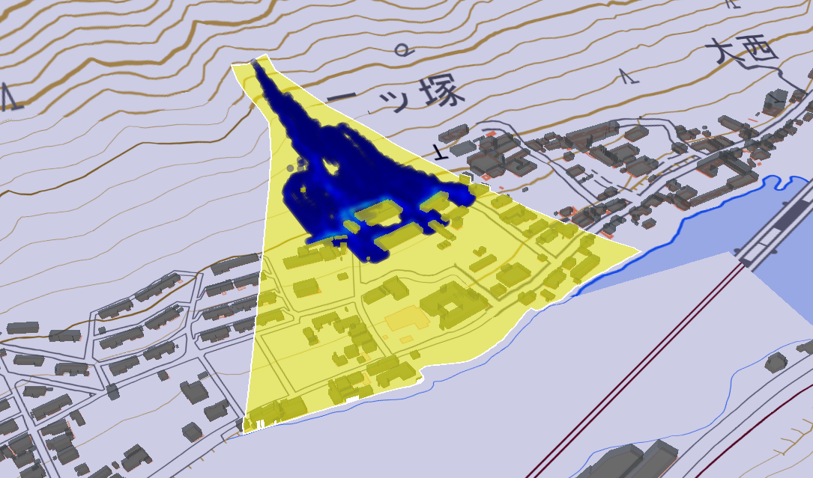

# 可視化コンバータ <!-- OSSの対象物の名称を記載ください。分かりやすさを重視し、できるだけ日本語で命名ください。英語名称の場合は日本語説明を（）書きで併記ください。 -->

 <!-- OSSの対象物のスクリーンショット（画面表示がない場合にはイメージ画像）を貼り付けください -->

## 1. 概要 <!-- 本リポジトリでOSS化しているソフトウェア・ライブラリについて1文で説明を記載ください -->
本リポジトリでは、Project PLATEAUの令和4年度のユースケース開発業務の一部であるUC23-02「精緻な土砂災害シミュレーション」について、その成果物である「可視化コンバータ」のソースコードを公開しています。

「精緻な土砂災害シミュレーション」により、PLATEAUの3D都市モデルから得られる建物の形状や配置、さらに、
構造種別等の属性情報を考慮した精度の高い土石流シミュレーションが実施可能となります。

## 2. 「精緻な土砂災害シミュレーション」について <!-- 「」内にユースケース名称を記載ください。本文は以下のサンプルを参考に記載ください。URLはアクセンチュアにて設定しますので、サンプルそのままでOKです。 -->
現在運用されている土砂災害警戒区域・土砂災害特別警戒区域（以下「土砂災害警戒区域等」とする）のハザード情報は、
地形から力学的に推定される最大範囲を網羅するものとなっていますが、
地域によっては居住エリアの大半が土砂災害警戒区域等に指定されており、実質的には避難場所の選定が困難な状況が発生しています。
また、一般的には土石流に起因する土砂災害警戒区域等は地形条件から定められていますが、土石流等が家屋に衝突し、
家屋を流出・倒壊とさせたことによって生じたエネルギー変化や流動方向に対する変化の影響が評価されておらず、
実態に即した土石流の氾濫範囲となっていません。
本システムの詳細については[技術検証レポート](https://www.mlit.go.jp/plateau/file/libraries/doc/plateau_tech_doc_0030_ver01.pdf)を参照してください。

## 3. 利用手順 <!-- 下記の通り、GitHub Pagesへリンクを記載ください。URLはアクセンチュアにて設定しますので、サンプルそのままでOKです。 -->
本システムの構築手順及び利用手順については[利用チュートリアル](https://r5-plateau-acn.github.io/SolarPotential/)を参照してください。

## 4. システム概要 <!-- OSS化対象のシステムが有する機能を記載ください。 -->
・Morpho2DHより出力された時刻ごと水理量・変化した地形データ・家屋倒壊判定結果（それぞれCSVファイル）を、Terria Map上でタイムスタンプに従ったアニメーション表示ができるよう、CZML形式に変換します。  
  
・変換対象となるデータは、Morpho2DHのFortranサブルーチン「Building-collapse-detector」を呼び出して実行された土石流シミュレーションの出力結果である、時刻ごと水理量（流体力）・変化した地形データ（流動深）・建物メッシュごと倒壊判定結果（建物倒壊情報）・建物ごと倒壊判定結果（建物倒壊フラグ）の、CSVファイルです。  
  
・上記データを対象に、可視化コンバータでは以下を行うことができます。  
    流動深をcsvからczmlに変換します。  
    流体力をcsvからczmlに変換します。  
    建物倒壊情報をcsvからczmlに変換します。  
    建物倒壊フラグをcsvからczmlに変換します。  

## 5. 利用技術

| 種別              | 名称   | バージョン | 内容 |
| ----------------- | --------|-------------|-----------------------------|
| ライブラリ      | [pyproj](https://pyproj4.github.io/pyproj/stable/) | 3.6.0 | 地図投影と座標変換ライブラリ |
|       | [czml](https://github.com/cleder/czml) | 0.3.3 | czml読み書きライブラリ |

## 6. 動作環境 <!-- 動作環境についての仕様を記載ください。 -->
| 項目               | 最小動作環境                                                                                                                                                                                                                                                                                                                                    | 推奨動作環境                   | 
| ------------------ | ----------------------------------------------------------------------------------------------------------------------------------------------------------------------------------------------------------------------------------------------------------------------------------------------------------------------------------------------- | ------------------------------ | 
| OS                 | Microsoft Windows 10 または 11                                                                                                                                                                                                                                                                                                                  |  同左 | 
| CPU                | Intel Core i5以上                                                                                                                                                                                                                                                                                                                               | Intel Core i7以上              | 
| メモリ             | 8GB以上                                                                                                                                                                                                                                                                                                                                         | 16GB以上                        | 
| グラフィックカード             | Intel(R) HD Graphics 520以上                                                                                                                                                                                                                                                                                                                                         | NVIDIA GeForce RTX 2080以上                        | 
| ディスプレイ解像度 | 1024×768以上                                                                                                                                                                                                                                                                                                                                    |  1920x1080以上                   | 

## 7. 本リポジトリのフォルダ構成 <!-- 本GitHub上のソースファイルの構成を記載ください。 -->
| フォルダ名 |　詳細 |
|-|-|
| JavaScript code.txt | Cesium実行用のJavaScriptコードです |
| czml_from_bldg_iRIC.py | 建物崩壊フラグをcsvからczmlに変換します |
| czml_from_csv_collapse.py | 建物崩壊情報をcsvからczmlに変換します |
| czml_from_csv_depth.py | 流動深をcsvからczmlに変換します |
| czml_from_csv_fbuilding.py | 流体力をcsvからczmlに変換します |
| log_lonlat_JS生成_テンプレ.xlsx | 緯度経度からJavaScriptコードを生成します |
| lonlat_from_czml.py | czmlから緯度経度を抽出します |
| rename.py | ファイル名を標準化します |

## 8. ライセンス <!-- 変更せず、そのまま使うこと。 -->

- ソースコード及び関連ドキュメントの著作権は国土交通省に帰属します。
- 本ドキュメントは[Project PLATEAUのサイトポリシー](https://www.mlit.go.jp/plateau/site-policy/)（CCBY4.0及び政府標準利用規約2.0）に従い提供されています。

## 9. 注意事項 <!-- 変更せず、そのまま使うこと。 -->

- 本リポジトリは参考資料として提供しているものです。動作保証は行っていません。
- 本リポジトリについては予告なく変更又は削除をする可能性があります。
- 本リポジトリの利用により生じた損失及び損害等について、国土交通省はいかなる責任も負わないものとします。

## 10. 参考資料 <!-- 技術検証レポートのURLはアクセンチュアにて記載します。 -->
- 技術検証レポート: https://www.mlit.go.jp/plateau/file/libraries/doc/plateau_tech_doc_0030_ver01.pdf
- PLATEAU WebサイトのUse caseページ「カーボンニュートラル推進支援システム」: https://www.mlit.go.jp/plateau/use-case/uc22-013/
